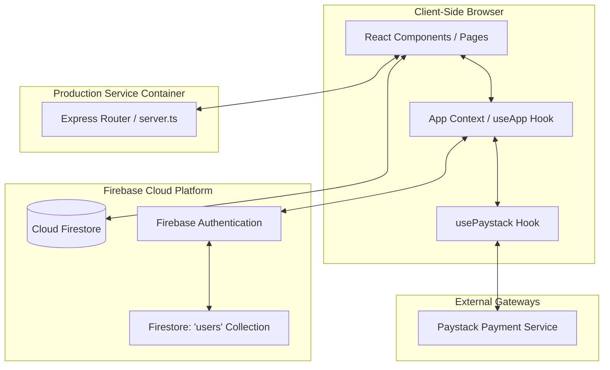
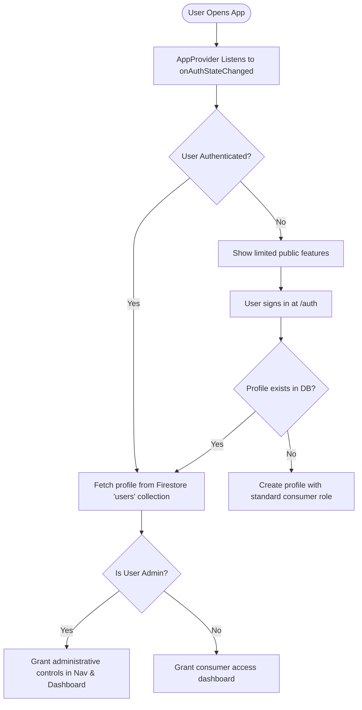
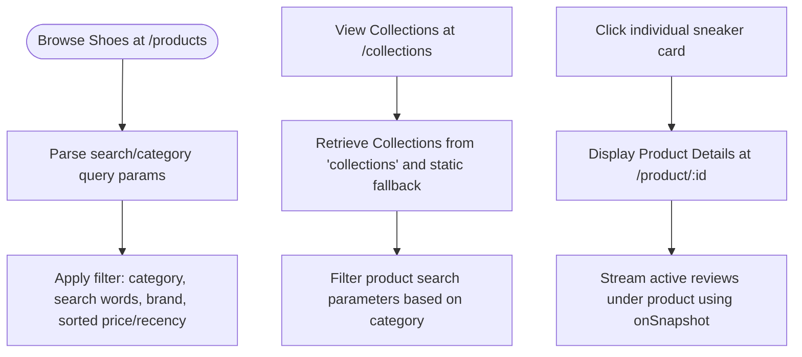
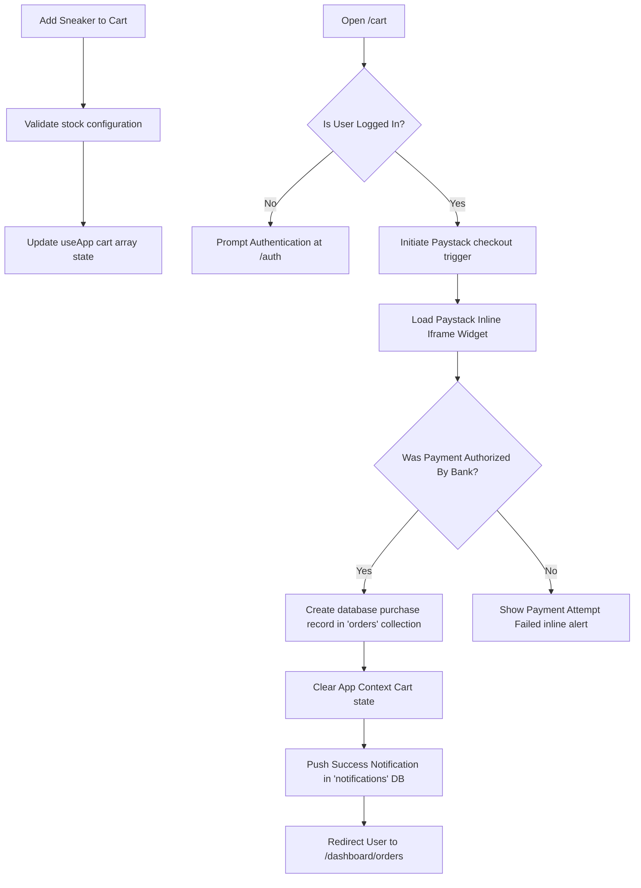
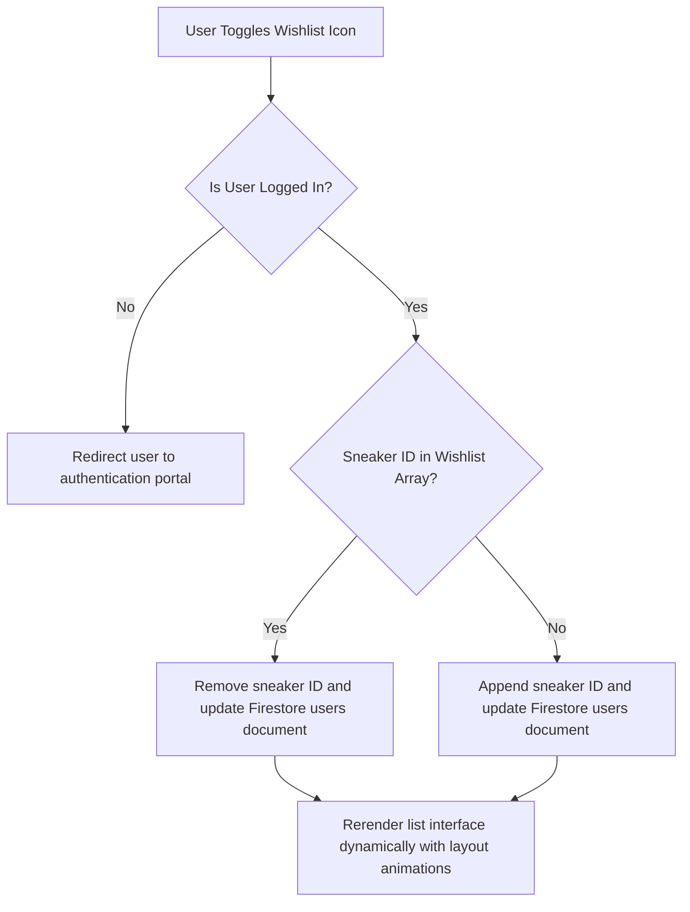

# Velocity Sneakers - Application Workflow Overview

This document describes the structural and interactive architecture of the **Velocity Sneakers** eCommerce application. It outlines the core system flow, data relationships, and state transitions using illustrative flowcharts.

---

## 1. High-Level Architecture Flow

The application follows a full-stack architecture. The frontend is built on **React 19 + TypeScript + Vite**, powered by a **Firestore** real-time database, with server-side proxy elements running on an **Express** node backend.

---

## 2. Core Operational Workflows

Below are interactive workflows outlining state and data transitions across primary application features.

### A. Authentication & Session Bootstrapping
When a user launches the application, their session goes through a state synchronization sequence:

---

### B. Catalog Exploration, Filter, and Collections
The product catalogue and dynamic categories stream directly from the static seed data fallback and live Firestore database collections:

---

### C. Shopping Cart, Payment Checkout, and Notification Flow
Orders undergo atomic validation, processing, and checkout verification before generating notifications:

---

### D. Wishlist Persistence Mechanism
The Wishlist logic is decoupled from local session loss, utilizing both real-time DB states and fallback sample assets:

---

## 3. Database Schema Overview

The database uses Firestore to build relationships between users, items, transactions, reviews, and notifications:

*   **`users/{uid}`**: User profiles (email, full name, profile picture, wishlist arrays, and user permission level tags). Prevented email layout string truncation.
*   **`sneakers/{sneakerId}`**: Dynamic product archives containing custom configurations (brand names, pricing, description, imagery assets, sizes, tags, stock records).
*   **`reviews/{reviewId}`**: Verified user testimonials (rating index, product reference, timestamp, username).
*   **`orders/{orderId}`**: Detailed individual e-payments, logistics track sheets, transaction details, and reference codes.
*   **`collections/{colId}`**: Dynamic curated product categorizations.
*   **`notifications/{notifyId}`**: Inline real-time alerts shown to the user on completion of logistics activities or purchases.
